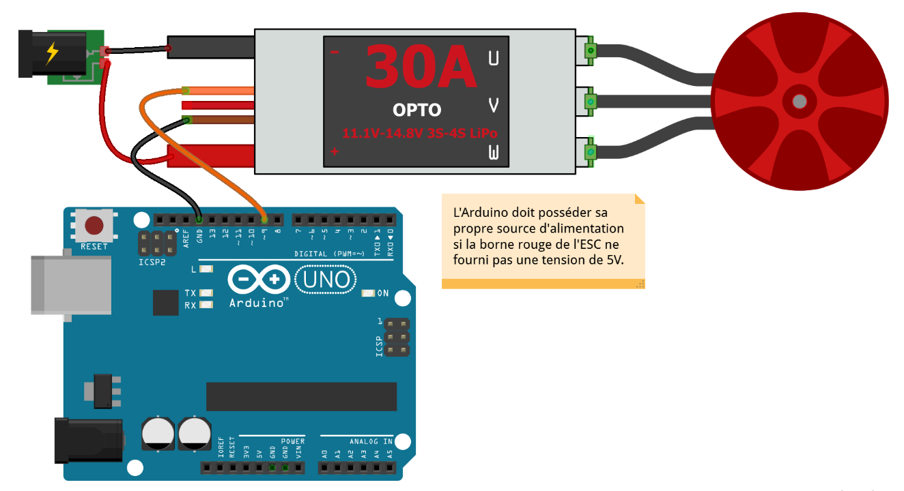
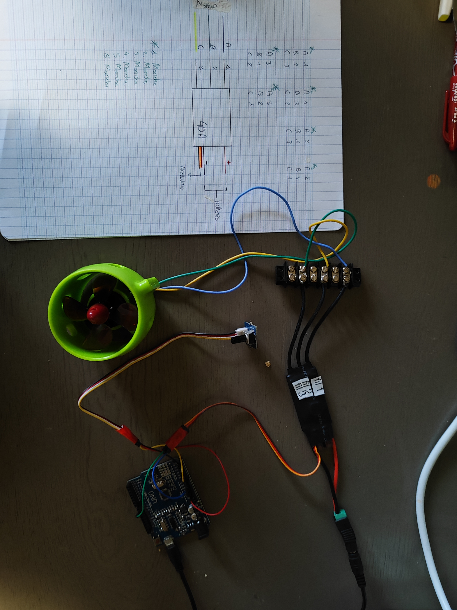

# **Séance 1 - 14/11/2023**
## Travail réalisé :

Lors de cette première séance, je me suis occupé de tester les moteurs que nous venions de recevoir. Pour cela, j'ai commencé par rechercher de la documentation sur le branchement des moteurs brushless. 
En utilisant ensuite cette documentation :

  -J'ai cherché comment brancher les ESC et les moteurs sur l'Arduino et je m'en suis servi pour allumer le moteur et le faire tourner.

  

  - Comme notre ECS ne correspond pas à 100% à celui èdu schéma, j'ai dû tester plusieurs configuration qui se sont révélées toutes bonnes. Au final il s'est avéré que l'ECS acheté permet d'intervertir les câbles qui le relient au moteur.

    
  
  - Mes tests ont malheureusement été interrompus par une surtension qui a cassé la carte arduino ainsi que les ports usb de mon pc.
## Objectifs pour la semaine prochaine :

Lors de la prochaine séance l'objectif principal sera de commencé à coder des fonctions basiques qui agissent sur les moteurs et permettront de faire marcher les moteurs choisis avec une vitesse en entrée.
