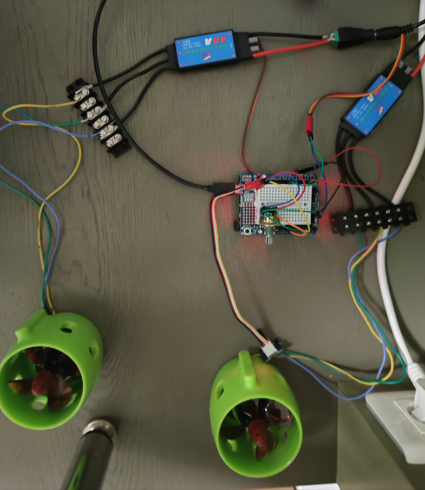

# **Séance 3 - 08/12/2023**
## Travail réalisé :
Lors de cette scéance j'ai commencé à travailler sur la jetson nano qui va servir à calculer et à donner les consignes de vitesse à la carte Arduino.
Dans un premier temps j'ai effectué le montage suivant :

