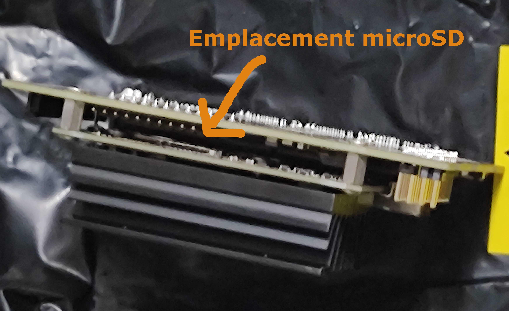

# **Séance 3 - 08/12/2023**
## Travail réalisé :
Lors de cette scéance j'ai commencé à travailler sur la jetson nano qui va servir à calculer et à donner les consignes de vitesse à la carte Arduino.

Dans un premier temps, dans l'objectif de tester si mon programme fonctionne pour contrôler plusieurs moteurs en même temps, j'ai effectué le montage suivant :

Et ajouter le code du fichier "CodeS3", pour ensuite effectuer des tests pour contrôler plusieurs moteurs en même temps.

Ensuite j'ai commencer à m'intéresser à la carte Nvidia jetson nano, et ai suivi certaines étapes nécessaires à son initialisation :
  - J'ai tout d'abord localiser où mettre le stockage qui servira pour le code du robot.

  - Ensuite j'ai formater la carte microSD en suivant les instructions du site constructeur : https://developer.nvidia.com/embedded/learn/get-started-jetson-nano-devkit#write
  
